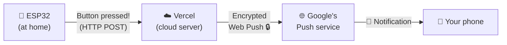
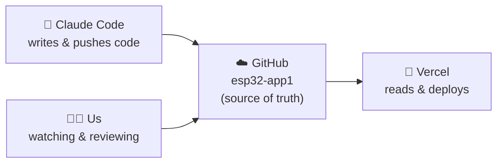
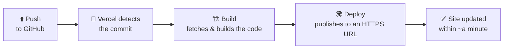
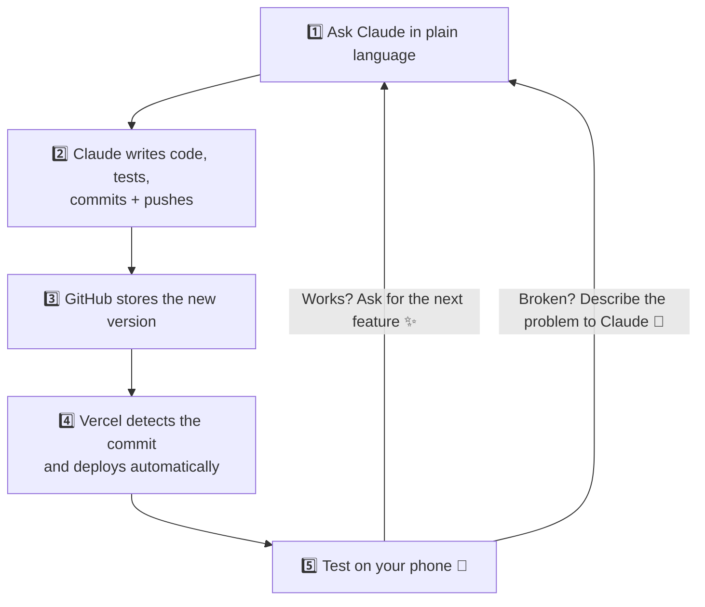
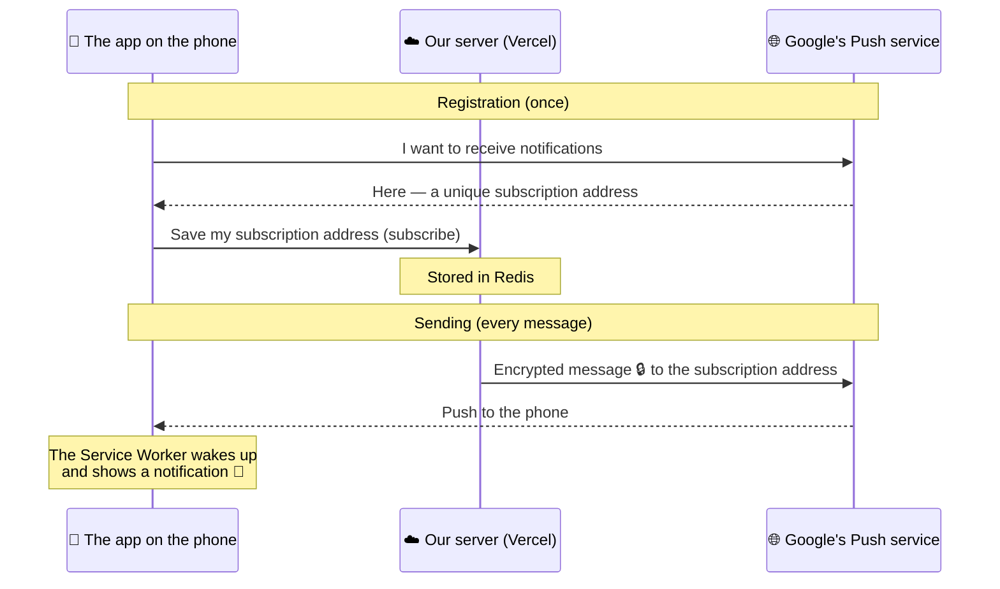

**🇮🇱 [המדריך הזה זמין גם בעברית](README.md)**

# 📘 Lesson Summary — Claude Code, Git/GitHub, Vercel & ESP32

> A complete beginner's guide: what we built, how each tool works, and why we need it at all.

## 🎯 Goal of the lesson

In this lesson we built a **real, end-to-end system**:

> The ESP32 sends a message 📤 → and your phone gets a **push notification** 🔔 — from anywhere in the world, even when the app is closed and the screen is off.

But the real goal was bigger: learning **how developers work today** —

- 🤖 **Claude Code** — an AI that writes the code for us
- 📚 **Git + GitHub** — saving every version of the code in the cloud
- 🚀 **Vercel** — publishing the app to the internet **automatically** on every change
- 📡 **ESP32** — the WiFi-enabled microcontroller that talks to all of it

📌 Our project links:

- The code (GitHub repository): https://github.com/v1t3ls0n/esp32-app1
- The live app (Vercel deployment): https://esp32-app1-dve4lt4f2-v1t3ls0ns-projects.vercel.app/

---

# Part A — 🧩 The big picture

Before diving into the tools, let's understand what the system does. This is the journey of a single message:



Three players:

1. **The ESP32** — connected to WiFi; when something happens (a button press, a sensor trigger) it sends a message to the server.
2. **The cloud server (Vercel)** — receives the message and forwards it as a "push" to the phone.
3. **The app on the phone** — a browser app (PWA) installed on the home screen that receives the push and shows a notification.

📌 Notice something amazing: **we didn't buy a server, didn't install anything on a computer, and didn't type the code ourselves.** All of it happened with the tools we're about to meet.

---

# Part B — 🌐 Fundamentals: the internet in plain language

Before talking about the tools, we need a few concepts the whole system is built on. Without them — everything sounds like magic. With them — everything makes sense.

## B.1 🖥️ What is a server?

A server is simply **a computer whose job is to wait for requests — and answer them**.

Think of a hotel receptionist 🏨: they sit at the desk, and everyone who walks up asks for something — "give me my room key", "what time is breakfast?" — and the receptionist answers. They don't start conversations; they **respond to requests**.

- The computer/phone that sends a request is called the **client**
- The computer that answers is called the **server**

When you browse a website — your browser is the client, and the computer hosting the site is the server. In our project: both the ESP32 and the phone are clients, and Vercel is the server.

## B.2 ☁️ What is "the cloud"?

"The cloud" sounds mysterious, but the truth is simple (and slightly disappointing 😄):

> **The cloud = other people's computers, sitting in giant data centers, where we rent space.**

Why is that genius?

- ❌ Without the cloud: buy a computer, keep it on 24/7 at home, configure networking, worry about power and security...
- ✅ With the cloud: click a button, and within a minute you have a "computer" running at Amazon/Google/Vercel — and they handle everything else.

## B.3 📬 What are HTTP and HTTPS?

For a client and a server to understand each other, they need a **common language**. That language is **HTTP** — a "request → response" protocol:

**Anatomy of a request:**

- **URL** — where to. For example: `https://esp32-app1.vercel.app/api/notify`
- **Method** — what kind of action:
  - `GET` = "give me information" 📥 (like opening a web page)
  - `POST` = "here is information for you" 📤 (like submitting a form)
- **Headers** — metadata, like "who I am" (this is where we put the ESP32's password!)
- **Body** — the content itself (for us: the notification message)

**Anatomy of a response:**

- **Status code** — a number summarizing what happened:

| Code | Meaning | Example in our project |
|---|---|---|
| `200` | ✅ Success | The message was sent |
| `201` | ✅ Created | A new phone was registered |
| `401` | 🔒 Unauthorized | The ESP32 sent a wrong password |
| `404` | 🤷 Not found | An address that doesn't exist |
| `500` | 💥 Server error | Something blew up in our code |

- **Response body** — the data that came back (an HTML page, data, an error message...)

📌 And the **S** in HTTPS? **Secure** — exactly the same, but **encrypted** 🔒. Nobody along the way can read or forge the content. Push notifications work **only** over HTTPS — the browser refuses otherwise.

## B.4 📦 What is JSON?

When computers exchange data, they need an agreed format. **JSON** is the world's most popular one — plain text of "name: value" pairs:

```json
{
  "title": "ESP32",
  "message": "Button pressed! ⚡"
}
```

That's everything the ESP32 sends to the server. Human-readable ✅, machine-readable ✅.

## B.5 🚪 What is an API?

Now the part that connects everything. An **API** (Application Programming Interface) is:

> **The server's official menu — the list of requests it accepts, and what it returns for each one.**

The best analogy: **a restaurant** 🍽️

- You (the client) don't walk into the kitchen and cook
- You order **from the menu** — a defined list of dishes
- The waiter takes your order to the kitchen and brings back the dish

The menu = the API. Each "dish on the menu" is called an **endpoint** — a specific address that does a specific thing.

And this is **our** server's menu:

| Endpoint | Method | What it does |
|---|---|---|
| `/api/subscribe` | POST | "Register this phone for notifications" |
| `/api/notify` | POST | "Send a notification to everyone registered" (password required!) |
| `/api/vapidPublicKey` | GET | "Give me the public key" |
| `/api/health` | GET | "Are you alive? How many subscribers?" |

📌 Why is the API such an important idea? Because it **decouples the asker from the doer**. The ESP32 doesn't care how the server is written or what happens inside — it only needs to know the menu. This is how all the world's software talks: the weather app with weather servers, Waze with Google's maps — it's all APIs.

---

# Part C — 🛠️ The tools, in depth

## C.1 📚 Git — a time machine for code

### The problem Git solves

Imagine writing an important paper. You save copies: `paper.docx`, `paper_fixed.docx`, `paper_final.docx`, `paper_final_REALLY2.docx` 😅

Now imagine a software project with **hundreds of files**, several people working **in parallel**, where any small change can break everything. Guaranteed chaos.

### The solution: save points

**Git** is a program that turns a regular folder into a **repository** — a folder with memory. From that moment, at any point you choose you can make a **commit**:

> Commit = a snapshot 📸 of **all** the files at that moment + a message explaining what changed + a timestamp and author name.

And the whole history is kept. This is what our project's history looked like at the end of the lesson:

```
9260403  Add lesson summary docs (Hebrew + English)
6b079fd  Convert relay to Vercel serverless + Redis for deployment
c0e6f93  Add ESP32 → Web Push notification system
f75c5d4  יאללה  (the first commit)
```

You can read it like a travel journal: every line is a point in time you can **go back to**, compare against, and see exactly what changed.

### Commands worth knowing

In class, Claude ran them for us — but it's important to understand what each one does:

| Command | What it does |
|---|---|
| `git status` | "What changed since the last commit?" |
| `git add .` | "Mark all changes for the next commit" |
| `git commit -m "description"` | "Take a save point with this message" |
| `git push` | "Send my commits to GitHub" ⬆️ |
| `git pull` | "Bring me the new commits from GitHub" ⬇️ |
| `git log` | "Show me the history" |
| `git clone <url>` | "Copy an entire repo from GitHub to my machine" |

### And what is a branch?

Git lets you split history into parallel "branches" — e.g., a branch for experiments without touching the stable version. It's a powerful tool for large teams, but **in our project we decided to keep it simple: a single branch named `main`**, with every commit going straight to it. For beginners — that's the right way to start.

## C.2 ☁️ GitHub — the code's home in the cloud

### What is it, really?

**GitHub is a website that hosts Git repositories in the cloud.** That's it. But from that simple thing follows a lot:

- 💾 **Backup** — laptop stolen? burned? The code is in the cloud, with full history.
- 🌍 **Access from anywhere** — the same repo available from any computer.
- 👥 **Collaboration** — several people work on the same code, and Git knows how to merge the changes.
- 🔌 **And most important for our lesson: integrations** — GitHub is the "hub" all the other tools connect to.

### The most important distinction

People mix these up all the time, so:

| | Git | GitHub |
|---|---|---|
| What is it? | Software running on your computer | A website |
| Role | Manages versions in a folder | Hosts repositories in the cloud |
| Analogy | Email (the technology) | Gmail (the service) |

### What do you see on GitHub's website?

Opening our repo you see:

- 📁 **The files** — the full folder tree, with a viewer for every file
- 🕐 **Commits** — the entire history; inside each commit you can see **exactly which lines changed** (green = added, red = removed)
- 📄 **README** — the documentation file shown on the repo's front page

### Who connects to our repo?



📌 This is why GitHub is called the **"source of truth"**: what's in it — that's the project. Not what's on somebody's laptop.

## C.3 🤖 Claude Code — the programmer that works for you

### The difference between a chatbot and an agent

Most of you know "regular" Claude (the chat): ask a question → get a text answer. But **Claude Code is something else — an agent**:

| Chatbot 💬 | Agent 🤖 |
|---|---|
| Answers with text | **Performs actions** |
| "Here's code you can copy" | Writes the code directly into the repo's files |
| Doesn't know what you have | Reads the whole project before answering |
| You test manually | Runs tests itself and fixes what broke |
| — | Commits and pushes to GitHub |

### What did Claude actually do in class?

Worth seeing the full list, because it shows how much work was saved:

1. Asked us clarifying questions about the architecture (before writing a single line!)
2. Designed the structure: app + server + firmware
3. Wrote all the files — about 15 of them
4. Generated the app icons with a Python script
5. **Tested itself**: ran the server, sent requests, verified the auth rejects bad passwords and the encryption is correct
6. Committed with a proper message and pushed to GitHub
7. And when we asked to move to Vercel — rewrote the whole server side for a different architecture, and tested again

### How to phrase a good request to an agent

This is **the new skill** this lesson teaches. A few principles:

- ✅ **Describe the goal, not the solution**: "I want a notification on my phone when the ESP32 sends a message" — and let it propose how.
- ✅ **Give context**: what hardware you have, what you know, your constraints ("I have an Android phone with Chrome").
- ✅ **Decide when it asks**: an agent's questions = architecture decisions. Read them seriously.
- ✅ **Ask for explanations**: "explain what you did and why" — the agent is also an excellent teacher.
- ❌ **Don't assume it reads minds**: "make it work" is a bad request. What is "it"? What is "work"?

### The human's role didn't disappear — it changed

📌 Claude is the worker; **you are the manager**. You: define what to build, answer the decision questions, test the result in the real world (did the phone ring or not?), and decide what's next. In class, for example, we stopped it mid-way and said "no branches, just one main branch" — and it reorganized everything. That's exactly the dynamic.

## C.4 🚀 Vercel — from code to the internet, automatically

### The problem Vercel solves

We have code on GitHub. But code on GitHub is just **stored text** — nothing *runs*. For the phone to reach the app, someone needs:

1. A computer that's always on and connected
2. A permanent address (URL) pointing at it
3. An HTTPS certificate (mandatory for notifications!)
4. And someone to update the code there on every change...

### The solution: connect once, publish forever

You connect Vercel to the GitHub repo **once**, and from that moment — on every push:



This process is called a **deployment**, and in the professional world — **CI/CD** (Continuous Integration / Continuous Deployment). Nobody "uploads files to a server" by hand in 2026.

### Key Vercel concepts

- **Production deployment** — the published version of the `main` branch; the "official version" at the permanent URL.
- **Environment variables** — secret values (keys, passwords) the code needs but must **never** live in the code itself (the repo is public!). You set them in Vercel's dashboard and the code reads them at runtime. ⚠️ After changing them — you must **Redeploy**.
- **Storage** — Vercel also offers one-click databases (for us: Redis for the subscriber list).
- **Logs** — every request to the server is recorded; the first place to look when something doesn't work.
- 💰 **Price** — for personal/learning use: **free**.

---

# Part D — 🔁 The workflow: the full loop

Now that we know all the players, this is what working actually looks like — over and over:



📌 This is the most important point of the lesson: **your job is not to type code — it's to define what you want, understand what's happening, and verify it works.** The tools do the rest.

---

# Part E — 👣 The complete step-by-step guide

The practical part — each step with exactly what to click, what should happen, and what to do if it doesn't.

## Step 0: What you need before starting 🎒

- ✅ A **GitHub** account (free) — github.com/signup
- ✅ A **Vercel** account (free) — vercel.com/signup → easiest to sign up **with your GitHub account** (then they're connected automatically)
- ✅ Access to **Claude** — claude.ai
- ✅ **Arduino IDE** installed, with ESP32 board support
- ✅ An **ESP32** board + USB cable
- ✅ An **Android phone with Chrome**

## Step 1: Create a repo on GitHub 📁

1. Go to github.com → click **+** at the top → **New repository**
2. Give it a name (ours: `esp32-app1`)
3. Choose **Public**
4. Click **Create repository**

✔️ **What should happen:** an empty repo page opens. That's fine — Claude will fill it.

## Step 2: Open a Claude Code session on the repo 🤖

1. Go to claude.ai/code (or install the CLI in your terminal)
2. Connect your GitHub account and pick the repo
3. From this moment Claude can read, write, run and push

## Step 3: Ask for the system in plain language 💬

Roughly how the request was phrased in class:

> "I have an ESP32 and an Android phone with Chrome. I can install browser apps as phone apps. Let's build a simple system: the ESP32 sends a message to the app, and the app shows the message it received as a notification on my device."

Claude stopped and asked **two decision questions** before writing any code:

- ❓ *"Should the system work only on your home network, or from anywhere over the internet?"* → we chose: **anywhere** 🌍
- ❓ *"Should notifications arrive even when the app is closed?"* → we chose: **yes** (real Web Push) 🔔

📌 Note — these are **architecture** decisions. Choosing "anywhere + app closed" is what required a cloud server, HTTPS, and Web Push. Had we chosen "home network only" — we'd have gotten a completely different (and simpler) system.

## Step 4: Claude builds the project 🏗️

After a few minutes of work (writing, testing, fixing) — the repo looks like this:

| Folder | What's inside |
|---|---|
| `public/` | The app (PWA): HTML page, JavaScript, icons, and the Service Worker |
| `api/` | Four server functions that run in Vercel's cloud |
| `firmware/` | The ESP32 sketch for the Arduino IDE |
| `scripts/` | A one-off script for generating VAPID keys |
| `README.md` | The guide you're reading right now 😉 (condensed technical instructions: `docs/DEPLOY.md`) |

✔️ **What should happen:** you see the files on GitHub, with a new commit in the history.

## Step 5: Connect the repo to Vercel 🔗

1. Go to vercel.com/new
2. In the list of your GitHub repos — click **Import** next to `esp32-app1`
3. **Framework Preset**: choose **Other** (we have no framework — static files + functions)
4. Click **Deploy** and wait about a minute ⏳

✔️ **What should happen:** a celebration screen 🎉 with a URL like `https://esp32-app1.vercel.app`. The site is live!

⚠️ **But it doesn't really work yet** — it's missing its secrets. That's the next step.

## Step 6: Configure secrets — environment variables 🔐

**6a. Generate VAPID keys** (the key pair that identifies our server):

On your computer, in the project folder:

```bash
npm install       # installs the libraries
npm run gen-keys  # prints a fresh key pair
```

(Don't have the project locally? Just ask Claude to run it and print the output.)

**6b. Connect a database:** in the Vercel dashboard → **Storage** → **Create Database** → **Upstash Redis** → connect it to the project. The two connection variables are added automatically. ✅

**6c. Add the remaining variables:** **Settings → Environment Variables**, one by one:

| Variable | Value |
|---|---|
| `VAPID_PUBLIC_KEY` | from the `gen-keys` output |
| `VAPID_PRIVATE_KEY` | from the `gen-keys` output (secret!) |
| `VAPID_SUBJECT` | `mailto:your@email.com` |
| `DEVICE_TOKEN` | a long random password you invent |

**6d. ⚠️ The step everyone forgets: Redeploy!** Environment variables load only at deploy time. **Deployments → ⋯ → Redeploy**.

## Step 7: Install the app on the phone 📱

1. Open the Vercel URL in **Chrome on Android**
2. Tap **"Enable notifications"** → Chrome asks for permission → **Allow** ✅
3. Tap **"Send test notification"** → a local notification should pop 🔔
4. Chrome menu (⋮) → **"Add to Home screen"** → **Install**

✔️ **What should happen:** a blue bell icon on the home screen, opening as a full-screen app.

## Step 8: Flash the ESP32 🔥

1. Open `firmware/esp32-notify/esp32-notify.ino` in the Arduino IDE
2. Update the **config block** at the top of the file:

```cpp
const char* WIFI_SSID    = "YOUR_WIFI_NAME";
const char* WIFI_PASS    = "YOUR_WIFI_PASSWORD";
const char* RELAY_URL    = "https://<your-project>.vercel.app/api/notify";
const char* DEVICE_TOKEN = "exactly-the-same-password-as-in-vercel";
```

3. Select the board (**Tools → Board → ESP32 Dev Module**) and the port
4. **Upload** ⬆️
5. Open the **Serial Monitor** at **115200** baud to watch what happens

✔️ **What should happen:** the Serial Monitor shows the WiFi connecting, and then — **the phone rings**: "The ESP32 is online! 🚀". From now on, every press of the board's **BOOT** button = another notification ⚡

## Step 9: Test and diagnose 🧪

You can test the server without the ESP32, from any computer:

```bash
# "Pulse check" — is the server alive? how many subscribers?
curl https://<your-project>.vercel.app/api/health

# Send a real notification from the terminal
curl -X POST https://<your-project>.vercel.app/api/notify \
  -H "Authorization: Bearer your-password" \
  -H "Content-Type: application/json" \
  -d '{"title":"Test","message":"Hello from my computer 👋"}'
```

## 🔧 Troubleshooting common problems

| Problem | Likely cause | Fix |
|---|---|---|
| Notification doesn't arrive | Not subscribed / permission denied | Open the app → "Enable notifications" → verify the permission is allowed in Chrome's settings |
| Server returns `401` | `DEVICE_TOKEN` mismatch | Make sure the firmware password is **exactly identical** to the one in Vercel |
| Server returns `500` | Missing environment variable | Check all 4 variables are set + Redis is connected → **Redeploy** |
| `sent: 0` even though everything "works" | No subscribers in the database | Did the phone subscribe *before* you connected Redis? Subscribe again from the app |
| ESP32 won't connect to WiFi | Wrong SSID/password, or a 5GHz network | The ESP32 supports **2.4GHz only**; check the details in the Serial Monitor |
| Changed an env var and nothing happened | Forgot to Redeploy | Always Redeploy after changing variables ⚠️ |

📌 **The general diagnosis principle:** follow the flow. Did the ESP32 send? (Serial Monitor) → did the server receive? (Vercel Logs) → are there subscribers? (`/api/health`) → is the phone's permission granted? One link at a time.

---

# Part F — 🏗️ How the system works on the inside

Now that we've seen the "what", let's understand the "how" — in plain language.

## F.1 📱 What is a PWA?

**PWA** (Progressive Web App) = a website that behaves like an app:

- You install it on the home screen (no app store!)
- It opens full-screen, with its own icon
- And most importantly for us: it can receive **push notifications**

📌 The huge advantage: write once in HTML/JavaScript — works on Android, iPhone and desktop.

## F.2 👷 What is a Service Worker?

The coolest part: a **Service Worker** is a piece of JavaScript the browser runs **in the background — even when the app is closed**.

Think of it as a doorman in a building 🏢: even after everyone has gone home, he stays. When a push message arrives — he wakes up and shows the notification.

In our project it's the file `public/sw.js`.

## F.3 🔔 How Web Push really works (and why VAPID)

Here's a surprising bit: our server **does not send the notification directly to the phone.** Why? Because the phone changes network addresses all the time (home WiFi, cellular on the road...) and there's no way to "find" it from outside.

Instead, every browser has a central **push service** (Google's, for Chrome) that keeps a permanent open connection to the phone. The full flow:



And **VAPID keys**? They're our server's "ID card". The subscription is tied to the public key, and every send is signed with the private key — so Google knows only *our* server may send notifications to *our* subscribers. Nobody can impersonate us.

## F.4 ⚡ What is Serverless?

On Vercel we don't have a computer running 24/7. Instead there are **functions** — every file in the `api/` folder is a function that wakes up only when a request arrives, runs for a second, and disappears.

✅ Advantages: free for hobby use, zero maintenance, scales by itself even to a million requests.
⚠️ The price: functions remember nothing between requests — which leads us to...

## F.5 🗄️ Why do we need a database (Redis)?

If the functions "disappear" after every request — where do we keep the list of registered phones? 🤔

That's why we connected **Redis** — a small, fast cloud database that does remember:

- The `subscribe` function **writes** each new subscription address to it
- The `notify` function **reads** all the addresses from it and sends to each one

📌 An important rule of thumb in the serverless world: **anything that must persist goes in a database. Not in memory and not in files.**

## F.6 🔑 What is DEVICE_TOKEN and why is it mandatory?

The `/api/notify` endpoint is open to the internet — **anyone in the world** can send it a request. Without protection, any kid with a computer could flood you with notifications 😱

So we set a **shared secret**:

- The ESP32 sends it with every request, in the `Authorization` header
- The server compares it to the value in the environment variables
- No match? → `401 Unauthorized` 🚫

This is the simplest form of **authentication** — a huge topic in software, met here in its minimal version.

---

# Part G — 🤖 What happens in the ESP32 code?

We won't go line by line (the full code is in the repo, under `firmware/`), but this is the essence:

```cpp
void setup() {
  connectWiFi();                                         // connect to the network
  sendNotification("ESP32", "The ESP32 is online! 🚀");  // "I'm alive" message
}

void loop() {
  // When the BOOT button is pressed → send a notification
  if (buttonPressed()) {
    sendNotification("ESP32", "Button pressed! ⚡");
  }
}
```

And the `sendNotification()` function does exactly one thing: sends an **HTTP POST** request (remember Part B?) to our server, with the message as JSON and the `DEVICE_TOKEN` in a header:

```
POST /api/notify HTTP/1.1
Host: esp32-app1.vercel.app
Authorization: Bearer the-secret-password
Content-Type: application/json

{ "title": "ESP32", "message": "Button pressed! ⚡" }
```

📌 You can replace this demo (boot message + BOOT button) with any logic you want: a distance sensor detecting motion (remember the HC-SR04 from lesson 2? 😉), a temperature sensor crossing a threshold, a light sensor... everything we learned in the course plugs in right here. 🔗

---

# Part H — 📖 Glossary

| Term | Plain-language meaning |
|---|---|
| **Server** | A computer that waits for requests and answers them |
| **Client** | Whoever sends the requests (browser, app, ESP32) |
| **Cloud** | Big companies' computers where we rent space |
| **HTTP/HTTPS** | The internet's "request language"; S = encrypted 🔒 |
| **GET / POST** | Request types: fetch information / send information |
| **Status code** | A number summarizing a response: 200=OK, 401=unauthorized, 500=error |
| **JSON** | A simple text format for structured data |
| **API** | The server's "menu" — which requests it accepts and what it returns |
| **Endpoint** | One specific address within an API |
| **Git** | Version-control software — a "time machine" for code |
| **Repository (repo)** | A project folder + its entire change history |
| **Commit** | A save point of the code, with a description of what changed |
| **Push / Pull** | Sending commits to GitHub / fetching commits from it |
| **Branch** | A parallel line of development (for us: just main) |
| **GitHub** | The website hosting repositories in the cloud — the "source of truth" |
| **Agent** | An AI that doesn't just answer — it acts: writes files, runs, pushes |
| **Deployment** | Publishing a version of the app to the internet |
| **CI/CD** | The principle that every code change is built and published automatically |
| **Environment variables** | Secret values kept outside the code (in Vercel) |
| **PWA** | A website that behaves like an app and installs to the home screen |
| **Service Worker** | Code that runs in the browser's background, even when the app is closed |
| **Web Push** | The notification mechanism via the browser's central push service |
| **VAPID** | The key pair identifying our server to the push service |
| **Serverless** | Server code running as on-demand functions, no 24/7 machine |
| **Redis** | A small, fast database that persists data between requests |
| **Authentication** | Verifying that whoever is asking is who they claim to be |
| **curl** | A terminal tool for sending HTTP requests — great for testing |

---

# 🏁 Lesson recap

✅ We learned the fundamentals: server, cloud, HTTP, JSON, API<br>
✅ We understood Git and GitHub — and why all the world's code is managed this way<br>
✅ We worked with Claude Code — defined requirements in plain language and got a complete system<br>
✅ We connected the repo to Vercel — and every commit automatically became a deployment<br>
✅ We installed a PWA on the phone with real push notifications (Web Push + Service Worker)<br>
✅ We connected an ESP32 to the cloud — and the phone rang 🔔<br>
✅ And most importantly: we experienced the **modern way of working** — define, understand, verify — and let the tools work for us 🤖🔥

---
