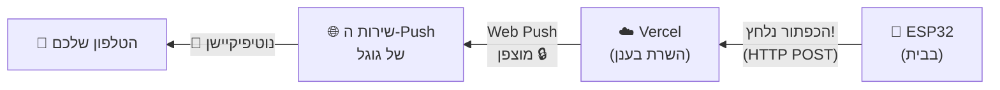
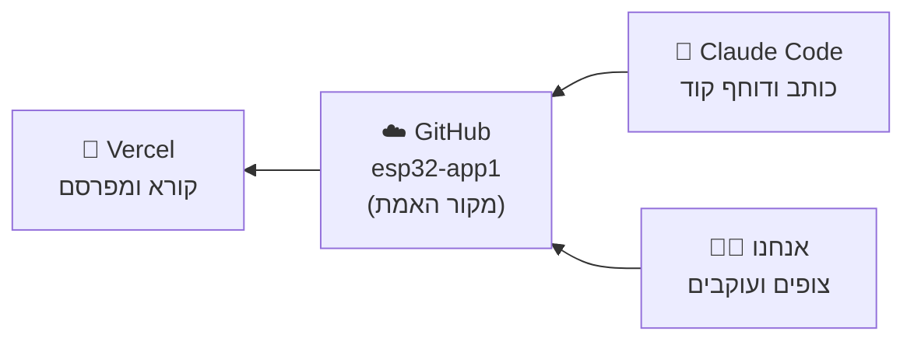
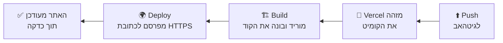
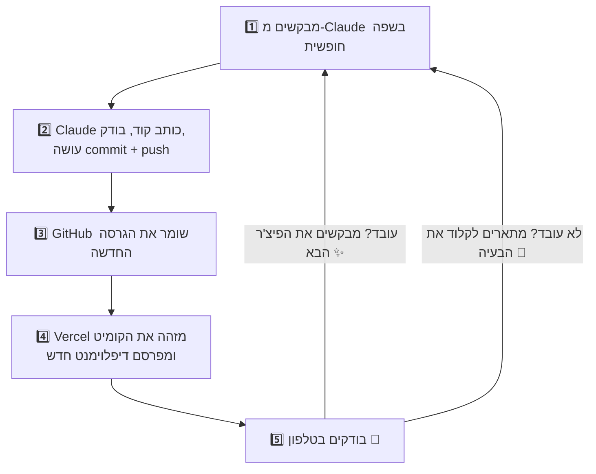
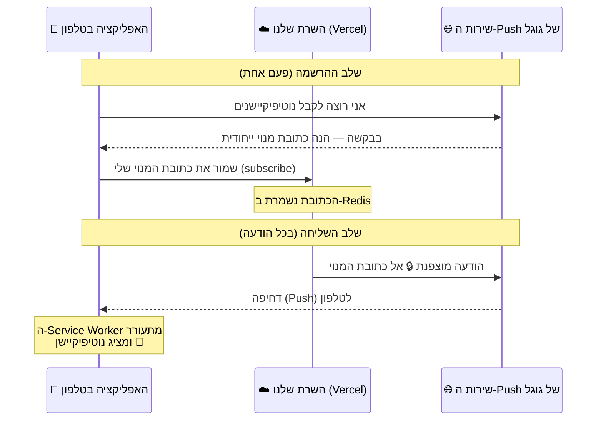

<div dir="rtl" style="direction:rtl">

**🇬🇧 [Read this guide in English](README.en.md)**

# 📘 סיכום שיעור — Claude Code, Git/GitHub, Vercel ו-ESP32

> מדריך מלא למתחילים: מה בנינו, איך כל כלי עובד, ולמה בכלל צריך אותו.

## 🎯 מטרת השיעור

בשיעור הזה בנינו מערכת **אמיתית, מקצה לקצה**:

> ה-ESP32 שולח הודעה 📤 ← והטלפון שלכם מקבל **נוטיפיקיישן** 🔔 — מכל מקום בעולם, גם כשהאפליקציה סגורה והמסך כבוי.

אבל המטרה האמיתית הייתה גדולה יותר: ללמוד **איך מפתחים עובדים היום** —

- 🤖 **Claude Code** — בינה מלאכותית שכותבת את הקוד בשבילנו
- 📚 **Git + GitHub** — שומרים כל גרסה של הקוד בענן
- 🚀 **Vercel** — מפרסם את האפליקציה לאינטרנט **אוטומטית** על כל שינוי
- 📡 **ESP32** — המיקרו-בקר עם ה-WiFi שמדבר עם כל זה

📌 לינקים של הפרויקט שלנו:

- הקוד (הריפו בגיטהאב): <span dir="ltr">https://github.com/v1t3ls0n/esp32-app1</span>
- האפליקציה החיה (ה-Deployment ב-Vercel): <span dir="ltr">https://esp32-app1-dve4lt4f2-v1t3ls0ns-projects.vercel.app/</span>

---

# חלק א׳ — 🧩 התמונה הגדולה

לפני שצוללים לכלים, בואו נבין מה המערכת עושה. ככה נראה המסע של הודעה אחת (קראו מימין לשמאל, בכיוון החצים):

</div>



<div dir="rtl" style="direction:rtl">

שלושה שחקנים:

1. **ה-ESP32** — מחובר ל-WiFi, וכשקורה משהו (כפתור נלחץ, חיישן קפץ) הוא שולח הודעה לשרת.
2. **השרת בענן (Vercel)** — מקבל את ההודעה ומעביר אותה הלאה כ"דחיפה" (Push) לטלפון.
3. **האפליקציה בטלפון** — אפליקציית דפדפן (PWA) שהתקנו על מסך הבית, שיודעת לקבל את הדחיפה ולהציג נוטיפיקיישן.

📌 שימו לב למשהו מדהים: **לא קנינו שרת, לא התקנו כלום על מחשב, ולא הקלדנו את הקוד בעצמנו.** כל זה קרה עם הכלים שנכיר עכשיו.

---

# חלק ב׳ — 🌐 מושגי יסוד: האינטרנט בשפה פשוטה

לפני שמדברים על הכלים, חייבים להבין כמה מושגים שכל המערכת בנויה עליהם. בלעדיהם — הכול נשמע כמו קסם. איתם — הכול הגיוני.

## ב.1 🖥️ מה זה שרת (Server)?

שרת הוא בסך הכול **מחשב שתפקידו לחכות לבקשות — ולענות עליהן**.

תחשבו על פקיד קבלה במלון 🏨: הוא יושב בעמדה, וכל מי שמגיע מבקש משהו — "תן לי מפתח לחדר", "מה שעות ארוחת הבוקר?" — והפקיד עונה. הוא לא יוזם שיחות, הוא **מגיב לבקשות**.

- המחשב/טלפון ששולח בקשה נקרא **לקוח** (Client)
- המחשב שעונה נקרא **שרת** (Server)

כשגולשים לאתר — הדפדפן שלכם הוא הלקוח, והמחשב שמחזיק את האתר הוא השרת. בפרויקט שלנו: גם ה-ESP32 וגם הטלפון הם לקוחות, ו-Vercel הוא השרת.

## ב.2 ☁️ מה זה "הענן" (Cloud)?

"הענן" נשמע מסתורי, אבל האמת פשוטה (וקצת מאכזבת 😄):

> **הענן = מחשבים של מישהו אחר, שיושבים בחוות שרתים ענקיות, ואנחנו שוכרים בהם מקום.**

למה זה גאוני?

- ❌ בלי ענן: קונים מחשב, משאירים אותו דלוק 24/7 בבית, מגדירים רשת, דואגים לחשמל ולאבטחה...
- ✅ עם ענן: לוחצים כפתור, ותוך דקה יש לכם "מחשב" שרץ אצל אמזון/גוגל/Vercel — והם דואגים לכל השאר.

## ב.3 📬 מה זה HTTP ו-HTTPS?

כדי שלקוח ושרת יבינו זה את זה, הם צריכים **שפה משותפת**. השפה הזו נקראת **HTTP** — פרוטוקול של "בקשה ← תשובה":

**מבנה של בקשה (Request):**

- **כתובת (URL)** — לאן פונים. למשל: <span dir="ltr"><code>⁨https://esp32-app1.vercel.app/api/notify⁩</code></span>
- **מתודה (Method)** — איזה סוג פעולה:
  - <span dir="ltr"><code>⁨GET⁩</code></span> = "תן לי מידע" 📥 (כמו לפתוח דף אינטרנט)
  - <span dir="ltr"><code>⁨POST⁩</code></span> = "הנה מידע בשבילך" 📤 (כמו לשלוח טופס)
- **כותרות (Headers)** — מידע נלווה, כמו "מי אני" (פה שמנו את הסיסמה של ה-ESP32!)
- **גוף (Body)** — התוכן עצמו (אצלנו: ההודעה לנוטיפיקיישן)

**מבנה של תשובה (Response):**

- **קוד סטטוס (Status Code)** — מספר שמסכם מה קרה:

| קוד | משמעות | דוגמה אצלנו |
|---|---|---|
| <span dir="ltr"><code>⁨200⁩</code></span> | ✅ הצליח | ההודעה נשלחה |
| <span dir="ltr"><code>⁨201⁩</code></span> | ✅ נוצר בהצלחה | טלפון חדש נרשם |
| <span dir="ltr"><code>⁨401⁩</code></span> | 🔒 לא מורשה | ה-ESP32 שלח סיסמה שגויה |
| <span dir="ltr"><code>⁨404⁩</code></span> | 🤷 לא נמצא | כתובת שלא קיימת |
| <span dir="ltr"><code>⁨500⁩</code></span> | 💥 שגיאה בשרת | משהו התפוצץ בקוד שלנו |

- **גוף התשובה** — המידע שחזר (דף HTML, נתונים, הודעת שגיאה...)

📌 ומה זה ה-**S** ב-HTTPS? **Secure** — אותו דבר בדיוק, אבל **מוצפן** 🔒. אף אחד באמצע הדרך לא יכול לקרוא או לזייף את התוכן. נוטיפיקיישנים עובדים **רק** על HTTPS — הדפדפן מסרב לעבוד בלי זה.

## ב.4 📦 מה זה JSON?

כשמחשבים שולחים מידע אחד לשני, הם צריכים פורמט מוסכם. **JSON** הוא הפורמט הפופולרי בעולם — טקסט פשוט של "שם: ערך":

</div>
<div dir="ltr" style="direction:ltr">

```json
{
  "title": "ESP32",
  "message": "הכפתור נלחץ! ⚡"
}
```

</div>
<div dir="rtl" style="direction:rtl">

זה כל מה שה-ESP32 שולח לשרת. קריא לבני אדם ✅, קריא למחשבים ✅.

## ב.5 🚪 מה זה API?

עכשיו החלק שמחבר הכול. **API** (ר"ת Application Programming Interface) הוא:

> **התפריט הרשמי של השרת — רשימת הבקשות שהוא מוכן לקבל, ומה הוא מחזיר על כל אחת.**

האנלוגיה הכי טובה: **מסעדה** 🍽️

- אתם (הלקוח) לא נכנסים למטבח ומבשלים בעצמכם
- אתם מזמינים **מהתפריט** — רשימה מוגדרת של מנות
- המלצר לוקח את ההזמנה למטבח ומחזיר את המנה

התפריט = ה-API. כל "מנה בתפריט" נקראת **Endpoint** (נקודת קצה) — כתובת ספציפית שעושה דבר ספציפי.

וזה התפריט של השרת **שלנו**:

| Endpoint | מתודה | מה זה עושה |
|---|---|---|
| <span dir="ltr"><code>⁨/api/subscribe⁩</code></span> | POST | "תרשום את הטלפון הזה לנוטיפיקיישנים" |
| <span dir="ltr"><code>⁨/api/notify⁩</code></span> | POST | "שלח נוטיפיקיישן לכל הרשומים" (דורש סיסמה!) |
| <span dir="ltr"><code>⁨/api/vapidPublicKey⁩</code></span> | GET | "תן לי את המפתח הציבורי" |
| <span dir="ltr"><code>⁨/api/health⁩</code></span> | GET | "אתה חי? כמה מנויים יש?" |

📌 למה API זה רעיון כל כך חשוב? כי הוא **מנתק בין מי שמבקש למי שמבצע**. ל-ESP32 לא אכפת איך השרת כתוב ומה קורה בפנים — הוא רק צריך לדעת את התפריט. ככה כל תוכנות העולם מדברות: אפליקציית מזג האוויר עם שרתי מזג האוויר, וויז עם המפות של גוגל — הכול API.

---

# חלק ג׳ — 🛠️ הכלים לעומק

## ג.1 📚 Git — מכונת זמן לקוד

### הבעיה שגיט פותר

דמיינו שאתם כותבים עבודה חשובה. אתם שומרים עותקים: <span dir="ltr"><code>⁨עבודה.docx⁩</code></span>, <span dir="ltr"><code>⁨עבודה_מתוקן.docx⁩</code></span>, <span dir="ltr"><code>⁨עבודה_סופי.docx⁩</code></span>, <span dir="ltr"><code>⁨עבודה_סופי_באמת2.docx⁩</code></span> 😅

עכשיו דמיינו פרויקט תוכנה עם **מאות קבצים**, שכמה אנשים עובדים עליו **במקביל**, וכל שינוי קטן יכול לשבור הכול. בלגן מובטח.

### הפתרון: נקודות שמירה

**Git** היא תוכנה שהופכת תיקייה רגילה ל**ריפוזיטורי (Repository)** — תיקייה עם זיכרון. מרגע זה, בכל נקודה שתבחרו אפשר לעשות **Commit**:

> Commit = צילום מצב 📸 של **כל** הקבצים באותו רגע + הודעה שמסבירה מה השתנה + חותמת זמן ושם המבצע.

וכל ההיסטוריה נשמרת. ככה נראתה ההיסטוריה של הפרויקט שלנו בסוף השיעור:

</div>
<div dir="ltr" style="direction:ltr">

```
9260403  Add lesson summary docs (Hebrew + English)
6b079fd  Convert relay to Vercel serverless + Redis for deployment
c0e6f93  Add ESP32 → Web Push notification system
f75c5d4  יאללה  (הקומיט הראשון)
```

</div>
<div dir="rtl" style="direction:rtl">

אפשר לקרוא את זה כמו יומן מסע: כל שורה היא נקודה בזמן שאפשר **לחזור אליה**, להשוות אליה, ולראות בדיוק מה השתנה בה.

### הפקודות שכדאי להכיר

בשיעור קלוד הריץ אותן בשבילנו — אבל חשוב להבין מה כל אחת עושה:

| פקודה | מה היא עושה |
|---|---|
| <span dir="ltr"><code>⁨git status⁩</code></span> | "מה השתנה מאז הקומיט האחרון?" |
| <span dir="ltr"><code>⁨git add .⁩</code></span> | "סמן את כל השינויים לקומיט הבא" |
| <span dir="ltr"><code>⁨git commit -m "תיאור"⁩</code></span> | "צלם נקודת שמירה עם ההודעה הזו" |
| <span dir="ltr"><code>⁨git push⁩</code></span> | "שלח את הקומיטים שלי לגיטהאב" ⬆️ |
| <span dir="ltr"><code>⁨git pull⁩</code></span> | "הבא אליי את הקומיטים החדשים מגיטהאב" ⬇️ |
| <span dir="ltr"><code>⁨git log⁩</code></span> | "הראה לי את ההיסטוריה" |
| <span dir="ltr"><code>⁨git clone <כתובת>⁩</code></span> | "העתק אליי ריפו שלם מגיטהאב" |

### ומה זה Branch (ענף)?

גיט מאפשר לפצל את ההיסטוריה ל"ענפים" מקבילים — למשל ענף לניסויים בלי לגעת בגרסה היציבה. זה כלי חזק לצוותים גדולים, אבל **בפרויקט שלנו החלטנו לעבוד פשוט: ענף אחד בלבד בשם <span dir="ltr"><code>⁨main⁩</code></span>**, וכל הקומיטים הולכים ישר אליו. למתחילים — זו הדרך הנכונה להתחיל.

## ג.2 ☁️ GitHub — הבית של הקוד בענן

### מה זה בעצם?

**GitHub הוא אתר שמארח ריפוזיטורים של גיט בענן.** זה הכול. אבל מהדבר הפשוט הזה נובע המון:

- 💾 **גיבוי** — המחשב נגנב? נשרף? הקוד בענן, עם כל ההיסטוריה.
- 🌍 **גישה מכל מקום** — אותו ריפו זמין מכל מחשב.
- 👥 **שיתוף פעולה** — כמה אנשים עובדים על אותו קוד, וגיט יודע למזג את השינויים.
- 🔌 **והכי חשוב לשיעור שלנו: אינטגרציות** — GitHub הוא ה"רכזת" שכל שאר הכלים מתחברים אליה.

### ההבחנה החשובה ביותר

מתבלבלים בזה כל הזמן, אז בגדול:

| | Git | GitHub |
|---|---|---|
| מה זה? | תוכנה שרצה על המחשב | אתר אינטרנט |
| תפקיד | מנהלת גרסאות בתיקייה | מארח ריפוזיטורים בענן |
| אנלוגיה | אימייל (הטכנולוגיה) | Gmail (השירות) |

### מה רואים באתר של גיטהאב?

כשנכנסים לריפו שלנו רואים:

- 📁 **הקבצים** — עץ התיקיות המלא, עם צפייה בכל קובץ
- 🕐 **Commits** — כל ההיסטוריה, ובכל קומיט אפשר לראות **בדיוק אילו שורות השתנו** (ירוק = נוסף, אדום = נמחק)
- 📄 **README** — קובץ התיעוד שמוצג בדף הבית של הריפו (אצלנו: הוראות ההתקנה המלאות)

### מי מתחבר לריפו שלנו?

</div>



<div dir="rtl" style="direction:rtl">

📌 זו הסיבה שגיטהאב נקרא **"מקור האמת"** (Source of Truth): מה שנמצא בו — זה הפרויקט. לא מה שעל המחשב של מישהו.

## ג.3 🤖 Claude Code — המתכנת שעובד בשבילכם

### ההבדל בין צ'אטבוט לסוכן (Agent)

את קלוד ה"רגיל" (הצ'אט) רובכם מכירים: שואלים שאלה ← מקבלים תשובה בטקסט. אבל **Claude Code הוא משהו אחר — סוכן (Agent)**:

| צ'אטבוט 💬 | סוכן 🤖 |
|---|---|
| עונה בטקסט | **מבצע פעולות** |
| "הנה קוד שאתה יכול להעתיק" | כותב את הקוד ישר לקבצים בריפו |
| לא יודע מה יש אצלכם | קורא את כל הפרויקט לפני שהוא עונה |
| אתם בודקים ידנית | מריץ בדיקות בעצמו ומתקן מה שנשבר |
| — | עושה commit ו-push לגיטהאב |

### מה קלוד עשה בשיעור בפועל?

שווה לראות את הרשימה המלאה, כי זה ממחיש כמה עבודה נחסכה:

1. שאל אותנו שאלות הבהרה על הארכיטקטורה (לפני שכתב שורת קוד!)
2. תכנן את המבנה: אפליקציה + שרת + firmware
3. כתב את כל הקבצים — כ-15 קבצים
4. יצר אייקונים לאפליקציה עם סקריפט Python
5. **בדק את עצמו**: הריץ את השרת, שלח בקשות, וידא שהאבטחה עובדת ושההצפנה תקינה
6. עשה commit עם הודעה מסודרת ו-push לגיטהאב
7. וכשביקשנו לעבור ל-Vercel — שכתב את כל צד השרת לארכיטקטורה אחרת, ובדק שוב

### איך מנסחים בקשה טובה לסוכן?

זו **המיומנות החדשה** שהשיעור הזה מלמד. כמה עקרונות:

- ✅ **תארו את המטרה, לא את הפתרון**: "אני רוצה נוטיפיקיישן בטלפון כשה-ESP32 שולח הודעה" — ותנו לו להציע איך.
- ✅ **תנו הקשר**: איזה חומרה יש, מה אתם יודעים, מה המגבלות ("יש לי טלפון אנדרואיד עם כרום").
- ✅ **החליטו כשהוא שואל**: שאלות של הסוכן = החלטות ארכיטקטורה. תקראו אותן ברצינות.
- ✅ **בקשו הסברים**: "תסביר לי מה עשית ולמה" — הסוכן הוא גם מורה מצוין.
- ❌ **אל תניחו שהוא קורא מחשבות**: "תעשה שזה יעבוד" זו בקשה גרועה. מה זה "זה"? מה זה "יעבוד"?

### תפקיד האדם לא נעלם — הוא השתנה

📌 קלוד הוא העובד; **אתם המנהלים**. אתם: מגדירים מה בונים, עונים על שאלות הכרעה, בודקים את התוצאה בעולם האמיתי (הטלפון צלצל או לא?), ומחליטים מה הלאה. בשיעור למשל עצרנו אותו באמצע ואמרנו "בלי ענפים, ענף אחד main וזהו" — והוא סידר הכול מחדש. זו בדיוק הדינמיקה.

## ג.4 🚀 Vercel — מהקוד לאינטרנט, אוטומטית

### הבעיה ש-Vercel פותר

יש לנו קוד בגיטהאב. אבל קוד בגיטהאב הוא רק **טקסט מאוחסן** — שום דבר לא *רץ*. כדי שהטלפון יוכל לגשת לאפליקציה, מישהו צריך:

1. מחשב שדולק תמיד ומחובר לאינטרנט
2. כתובת קבועה (URL) שמובילה אליו
3. תעודת HTTPS (חובה לנוטיפיקיישנים!)
4. ומישהו שיעדכן את הקוד שם בכל שינוי...

### הפתרון: חיבור חד-פעמי, פרסום אוטומטי לתמיד

מחברים את Vercel לריפו בגיטהאב **פעם אחת**, ומאותו רגע — על כל push:

</div>



<div dir="rtl" style="direction:rtl">

לתהליך הזה קוראים **Deployment** (פריסה), ובעולם המקצועי — **CI/CD** (אינטגרציה ופריסה רציפות). אף אחד לא "מעלה קבצים לשרת" ידנית ב-2026.

### מושגים חשובים ב-Vercel

- **Production Deployment** — הפרסום של ענף <span dir="ltr"><code>⁨main⁩</code></span>; זו "הגרסה הרשמית" שבכתובת הקבועה.
- **Environment Variables (משתני סביבה)** — ערכים סודיים (מפתחות, סיסמאות) שהקוד צריך אבל **אסור** שיהיו בקוד עצמו (כי הריפו גלוי!). מגדירים אותם בדשבורד של Vercel, והקוד קורא אותם בזמן ריצה. ⚠️ אחרי שינוי — חובה **Redeploy**.
- **Storage** — Vercel מציע גם מסדי נתונים בקליק (אצלנו: Redis לשמירת המנויים).
- **Logs** — כל בקשה שמגיעה לשרת נרשמת; זה המקום הראשון לחפש בו כשמשהו לא עובד.
- 💰 **המחיר** — לשימוש אישי/לימודי: **חינם**.

---

# חלק ד׳ — 🔁 שיטת העבודה: הלולאה המלאה

עכשיו, כשמכירים את כל השחקנים, ככה נראית העבודה בפועל — שוב ושוב:

</div>



<div dir="rtl" style="direction:rtl">

📌 זו הנקודה הכי חשובה בשיעור: **התפקיד שלכם הוא לא להקליד קוד — אלא להגדיר מה רוצים, להבין מה קורה, ולבדוק שזה עובד.** הכלים עושים את השאר.

---

</div>
<div dir="rtl" style="direction:rtl">

# חלק ה׳ — 👣 המדריך המלא: צעד-אחר-צעד

זה החלק המעשי — כל שלב עם מה בדיוק לוחצים, מה אמור לקרות, ומה לעשות אם לא.

## שלב 0: מה צריך לפני שמתחילים 🎒

- ✅ חשבון **GitHub** (חינם) — <span dir="ltr">github.com/signup</span>
- ✅ חשבון **Vercel** (חינם) — <span dir="ltr">vercel.com/signup</span> ← הכי נוח להירשם **עם חשבון הגיטהאב** (אז החיבור ביניהם אוטומטי)
- ✅ גישה ל-**Claude** — <span dir="ltr">claude.ai</span>
- ✅ **Arduino IDE** מותקן, עם תמיכת לוחות ESP32
- ✅ לוח **ESP32** + כבל USB
- ✅ טלפון **אנדרואיד עם Chrome**

## שלב 1: יוצרים ריפו בגיטהאב 📁

1. נכנסים ל-<span dir="ltr">github.com</span> ← לוחצים על **+** למעלה ← **New repository**
2. נותנים שם (אצלנו: <span dir="ltr"><code>⁨esp32-app1⁩</code></span>)
3. בוחרים **Public** (ריפו גלוי — נדרש לחלק מהחיבורים בחינם)
4. לוחצים **Create repository**

✔️ **מה אמור לקרות:** נפתח דף של ריפו ריק. זה בסדר — קלוד ימלא אותו.

## שלב 2: פותחים סשן Claude Code על הריפו 🤖

1. נכנסים ל-<span dir="ltr">claude.ai/code</span> (או מתקינים את ה-CLI בטרמינל)
2. מחברים את חשבון הגיטהאב ובוחרים את הריפו
3. מרגע זה קלוד רואה את הקוד ויכול לקרוא, לכתוב, להריץ ולדחוף

## שלב 3: מבקשים את המערכת בשפה חופשית 💬

ככה בערך נוסחה הבקשה בשיעור:

> "יש לי ESP32 וטלפון אנדרואיד עם כרום. אני יכול להתקין אפליקציות דפדפן כאפליקציות בטלפון. בוא נבנה מערכת פשוטה: ESP32 שולח הודעה לאפליקציה, האפליקציה שולחת את ההודעה שקיבלה כנוטיפיקיישן למכשיר."

קלוד עצר ושאל **שתי שאלות הכרעה** לפני שכתב שורת קוד:

- ❓ *"המערכת צריכה לעבוד רק ברשת הביתית, או מכל מקום דרך האינטרנט?"* ← בחרנו: **מכל מקום** 🌍
- ❓ *"הנוטיפיקיישן צריך להגיע גם כשהאפליקציה סגורה?"* ← בחרנו: **כן** (Web Push אמיתי) 🔔

📌 שימו לב — אלו החלטות **ארכיטקטורה**. הבחירה "מכל מקום + אפליקציה סגורה" היא שחייבה שרת בענן, HTTPS, ו-Web Push. אילו היינו בוחרים "רק ברשת הביתית" — היינו מקבלים מערכת אחרת לגמרי (ופשוטה יותר).

## שלב 4: קלוד בונה את הפרויקט 🏗️

אחרי כמה דקות של עבודה (כתיבה, בדיקות, תיקונים) — הריפו נראה ככה:

| תיקייה | מה יש בה |
|---|---|
| <span dir="ltr"><code>⁨public/⁩</code></span> | האפליקציה (PWA): דף HTML, קוד JavaScript, אייקונים, ו-Service Worker |
| <span dir="ltr"><code>⁨api/⁩</code></span> | ארבע פונקציות שרת שרצות בענן של Vercel |
| <span dir="ltr"><code>⁨firmware/⁩</code></span> | הסקצ' של ה-ESP32 ל-Arduino IDE |
| <span dir="ltr"><code>⁨scripts/⁩</code></span> | סקריפט חד-פעמי ליצירת מפתחות VAPID |
| <span dir="ltr"><code>⁨README.md⁩</code></span> | המדריך שאתם קוראים עכשיו 😉 (הוראות טכניות מקוצרות: <span dir="ltr"><code>⁨docs/DEPLOY.md⁩</code></span>) |

✔️ **מה אמור לקרות:** רואים את הקבצים בגיטהאב, עם קומיט חדש בהיסטוריה.

## שלב 5: מחברים את הריפו ל-Vercel 🔗

1. נכנסים ל-<span dir="ltr">vercel.com/new</span>
2. ברשימת הריפוזיטורים מגיטהאב — לוחצים **Import** ליד <span dir="ltr"><code>⁨esp32-app1⁩</code></span>
3. **Framework Preset**: בוחרים **Other** (אין לנו framework — קבצים סטטיים + פונקציות)
4. לוחצים **Deploy** ומחכים כדקה ⏳

✔️ **מה אמור לקרות:** מסך חגיגי 🎉 עם כתובת בסגנון <span dir="ltr"><code>⁨https://esp32-app1.vercel.app⁩</code></span>. האתר באוויר!

⚠️ **אבל הוא עוד לא עובד באמת** — כי חסרים לו הסודות. זה השלב הבא.

## שלב 6: מגדירים סודות — משתני סביבה 🔐

**6א. יוצרים מפתחות VAPID** (זוג המפתחות שמזהה את השרת שלנו):

במחשב, בתיקיית הפרויקט:

</div>
<div dir="ltr" style="direction:ltr">

```bash
npm install       # מתקין את הספריות
npm run gen-keys  # מדפיס זוג מפתחות חדש
```

</div>
<div dir="rtl" style="direction:rtl">

(אין לכם את הפרויקט מקומית? אפשר פשוט לבקש מקלוד להריץ ולהדפיס.)

**6ב. מחברים מסד נתונים:** בדשבורד של Vercel ← **Storage** ← **Create Database** ← **Upstash Redis** ← מחברים לפרויקט. שני משתני החיבור נוספים לבד. ✅

**6ג. מוסיפים את שאר המשתנים:** **Settings ← Environment Variables**, ומוסיפים אחד-אחד:

| שם המשתנה | הערך |
|---|---|
| <span dir="ltr"><code>⁨VAPID_PUBLIC_KEY⁩</code></span> | מהפלט של <span dir="ltr"><code>⁨gen-keys⁩</code></span> |
| <span dir="ltr"><code>⁨VAPID_PRIVATE_KEY⁩</code></span> | מהפלט של <span dir="ltr"><code>⁨gen-keys⁩</code></span> (סודי!) |
| <span dir="ltr"><code>⁨VAPID_SUBJECT⁩</code></span> | <span dir="ltr"><code>⁨mailto:המייל@שלכם.com⁩</code></span> |
| <span dir="ltr"><code>⁨DEVICE_TOKEN⁩</code></span> | סיסמה ארוכה ואקראית שאתם ממציאים |

**6ד. ⚠️ הצעד שכולם שוכחים: Redeploy!** משתני סביבה נטענים רק בפריסה. **Deployments ← ⋯ ← Redeploy**.

## שלב 7: מתקינים את האפליקציה בטלפון 📱

1. פותחים את כתובת ה-Vercel ב-**Chrome באנדרואיד**
2. לוחצים **"הפעל נוטיפיקיישנים"** ← כרום שואל הרשאה ← **אישור** ✅
3. לוחצים **"שלח נוטיפיקיישן בדיקה"** ← אמור לקפוץ נוטיפיקיישן מקומי 🔔
4. תפריט כרום (⋮) ← **"הוספה למסך הבית"** ← **התקנה**

✔️ **מה אמור לקרות:** אייקון פעמון כחול על מסך הבית, שנפתח כאפליקציה במסך מלא.

## שלב 8: צורבים את ה-ESP32 🔥

1. פותחים את <span dir="ltr"><code>⁨firmware/esp32-notify/esp32-notify.ino⁩</code></span> ב-Arduino IDE
2. מעדכנים את **בלוק ההגדרות** בראש הקובץ:

</div>
<div dir="ltr" style="direction:ltr">

```cpp
const char* WIFI_SSID    = "שם_הרשת_שלכם";
const char* WIFI_PASS    = "סיסמת_הרשת";
const char* RELAY_URL    = "https://<הפרויקט-שלכם>.vercel.app/api/notify";
const char* DEVICE_TOKEN = "אותה-סיסמה-בדיוק-כמו-ב-Vercel";
```

</div>
<div dir="rtl" style="direction:rtl">

3. בוחרים את הלוח (**Tools ← Board ← ESP32 Dev Module**) ואת הפורט
4. **Upload** ⬆️
5. פותחים **Serial Monitor** במהירות **115200** כדי לראות מה קורה

✔️ **מה אמור לקרות:** ב-Serial רואים התחברות ל-WiFi, ואז — **הטלפון מצלצל**: "The ESP32 is online! 🚀". ומעכשיו כל לחיצה על כפתור ה-**BOOT** בלוח = עוד נוטיפיקיישן ⚡

## שלב 9: בודקים ומאבחנים 🧪

אפשר לבדוק את השרת גם בלי ESP32, מכל מחשב:

</div>
<div dir="ltr" style="direction:ltr">

```bash
# בדיקת "דופק" — השרת חי? כמה מנויים?
curl https://<הפרויקט-שלכם>.vercel.app/api/health

# שליחת נוטיפיקיישן אמיתי מהטרמינל
curl -X POST https://<הפרויקט-שלכם>.vercel.app/api/notify \
  -H "Authorization: Bearer הסיסמה-שלכם" \
  -H "Content-Type: application/json" \
  -d '{"title":"בדיקה","message":"שלום מהמחשב 👋"}'
```

</div>
<div dir="rtl" style="direction:rtl">

## 🔧 פתרון תקלות נפוצות

| הבעיה | הסיבה הכנראה | הפתרון |
|---|---|---|
| הנוטיפיקיישן לא מגיע | לא נרשמתם / ההרשאה נדחתה | פתחו את האפליקציה ← "הפעל נוטיפיקיישנים" ← ודאו שההרשאה מאושרת בהגדרות כרום |
| השרת מחזיר <span dir="ltr"><code>⁨401⁩</code></span> | ה-<span dir="ltr"><code>⁨DEVICE_TOKEN⁩</code></span> לא תואם | ודאו שהסיסמה ב-firmware **זהה בדיוק** לזו שב-Vercel |
| השרת מחזיר <span dir="ltr"><code>⁨500⁩</code></span> | חסר משתנה סביבה | בדקו שכל 4 המשתנים מוגדרים + ה-Redis מחובר ← **Redeploy** |
| <span dir="ltr"><code>⁨sent: 0⁩</code></span> למרות שהכול "עובד" | אין מנויים במסד הנתונים | הטלפון נרשם *לפני* שחיברתם את Redis? הירשמו שוב מהאפליקציה |
| ה-ESP32 לא מתחבר ל-WiFi | שם רשת/סיסמה שגויים, או רשת 5GHz | ה-ESP32 תומך רק ב-**2.4GHz**; בדקו את הפרטים ב-Serial Monitor |
| שיניתם משתנה סביבה וכלום לא קרה | שכחתם Redeploy | תמיד Redeploy אחרי שינוי משתנים ⚠️ |

📌 **העיקרון הכללי לאבחון:** לכו בכיוון הזרימה. ה-ESP32 שלח? (Serial Monitor) ← השרת קיבל? (Logs ב-Vercel) ← יש מנויים? (<span dir="ltr"><code>⁨/api/health⁩</code></span>) ← ההרשאה בטלפון מאושרת? כל חוליה בנפרד.

---

</div>
<div dir="rtl" style="direction:rtl">

# חלק ו׳ — 🏗️ איך המערכת עובדת מבפנים

עכשיו כשראינו את ה"מה", בואו נבין את ה"איך" — בשפה פשוטה.

## ו.1 📱 מה זה PWA?

**PWA** (Progressive Web App) = אתר אינטרנט שמתנהג כמו אפליקציה:

- מתקינים אותו על מסך הבית (בלי חנות אפליקציות!)
- הוא נפתח במסך מלא, עם אייקון משלו
- והכי חשוב לנו: הוא יכול לקבל **נוטיפיקיישנים**

📌 היתרון הענק: כותבים פעם אחת ב-HTML/JavaScript — ועובד על אנדרואיד, אייפון ומחשב.

## ו.2 👷 מה זה Service Worker?

זה החלק הכי מגניב: **Service Worker** הוא קטע JavaScript שהדפדפן מריץ **ברקע — גם כשהאפליקציה סגורה**.

תחשבו עליו כמו שומר בכניסה לבניין 🏢: גם כשכולם הלכו הביתה, הוא נשאר. וכשמגיעה הודעת Push — הוא מתעורר, ומציג את הנוטיפיקיישן.

בפרויקט שלנו הוא הקובץ <span dir="ltr"><code>⁨public/sw.js⁩</code></span>.

## ו.3 🔔 איך Web Push באמת עובד (ולמה צריך VAPID)?

הנה קטע מפתיע: השרת שלנו **לא שולח את הנוטיפיקיישן ישירות לטלפון.** למה? כי הטלפון מחליף כתובות רשת כל הזמן (WiFi בבית, סלולר בדרך...) ואי אפשר "למצוא" אותו מבחוץ.

במקום זה, לכל דפדפן יש **שירות Push מרכזי** (של גוגל, בכרום) שמחזיק חיבור קבוע פתוח לטלפון. ככה נראה כל התהליך:

</div>



<div dir="rtl" style="direction:rtl">

ומפתחות **VAPID**? זו "תעודת הזהות" של השרת שלנו. ההרשמה נחתמת עם המפתח הציבורי, וכל שליחה נחתמת עם המפתח הפרטי — וככה גוגל יודעת שרק השרת *שלנו* רשאי לשלוח נוטיפיקיישנים למנויים *שלנו*. אף אחד לא יכול להתחזות.

## ו.4 ⚡ מה זה Serverless ("ללא שרת")?

ב-Vercel אין לנו מחשב שדולק 24/7. במקום זה יש **פונקציות** — כל קובץ בתיקיית <span dir="ltr"><code>⁨api/⁩</code></span> הוא פונקציה שמתעוררת רק כשמגיעה בקשה, רצה שנייה, ונעלמת.

✅ יתרונות: חינם בשימוש ביתי, אפס תחזוקה, נסקייל לבד גם למיליון בקשות.
⚠️ מחיר: הפונקציות לא זוכרות כלום בין בקשות — וזה מוביל אותנו ל...

## ו.5 🗄️ למה צריך מסד נתונים (Redis)?

אם הפונקציות "נעלמות" אחרי כל בקשה — איפה נשמור את רשימת הטלפונים הרשומים? 🤔

בשביל זה חיברנו **Redis** — מסד נתונים קטן ומהיר בענן, שכן זוכר לתמיד:

- הפונקציה <span dir="ltr"><code>⁨subscribe⁩</code></span> **כותבת** אליו כתובת מנוי חדשה
- הפונקציה <span dir="ltr"><code>⁨notify⁩</code></span> **קוראת** ממנו את כל הכתובות ושולחת לכולן

📌 כלל אצבע חשוב בעולם ה-Serverless: **מה שצריך להישמר — נשמר במסד נתונים. לא בזיכרון ולא בקבצים.**

## ו.6 🔑 מה זה DEVICE_TOKEN ולמה חייבים אותו?

הכתובת <span dir="ltr"><code>⁨/api/notify⁩</code></span> פתוחה לאינטרנט — **כל אחד בעולם** יכול לשלוח אליה בקשה. בלי הגנה, כל ילד עם מחשב יכול להציף אתכם בנוטיפיקיישנים 😱

לכן קבענו **סיסמה משותפת** (Shared Secret):

- ה-ESP32 שולח אותה בכל בקשה, בכותרת <span dir="ltr"><code>⁨Authorization⁩</code></span>
- השרת משווה מול הערך שבמשתני הסביבה
- לא תואם? ← <span dir="ltr"><code>⁨401 Unauthorized⁩</code></span> 🚫

זו הצורה הפשוטה ביותר של **אימות (Authentication)** — נושא ענק בעולם התוכנה, שכאן פגשנו אותו בגרסת המינימום.

---

# חלק ז׳ — 🤖 מה קורה בקוד של ה-ESP32?

לא ניכנס לכל שורה (הקוד המלא בריפו, בתיקיית <span dir="ltr"><code>⁨firmware/⁩</code></span>), אבל זו התמצית:

</div>
<div dir="ltr" style="direction:ltr">

```cpp
void setup() {
  connectWiFi();                                         // מתחברים לרשת
  sendNotification("ESP32", "The ESP32 is online! 🚀");  // הודעת "אני חי"
}

void loop() {
  // כשכפתור BOOT נלחץ → שולחים נוטיפיקיישן
  if (buttonPressed()) {
    sendNotification("ESP32", "Button pressed! ⚡");
  }
}
```

</div>
<div dir="rtl" style="direction:rtl">

והפונקציה <span dir="ltr"><code>⁨sendNotification()⁩</code></span> עושה בסך הכול דבר אחד: שולחת בקשת **HTTP POST** (זוכרים מחלק ב׳?) לשרת שלנו, עם ההודעה ב-JSON ועם ה-<span dir="ltr"><code>⁨DEVICE_TOKEN⁩</code></span> בכותרת:

</div>
<div dir="ltr" style="direction:ltr">

```
POST /api/notify HTTP/1.1
Host: esp32-app1.vercel.app
Authorization: Bearer הסיסמה-הסודית
Content-Type: application/json

{ "title": "ESP32", "message": "Button pressed! ⚡" }
```

</div>
<div dir="rtl" style="direction:rtl">

📌 את הדמו הזה (הודעה בהדלקה + כפתור BOOT) אפשר להחליף בכל לוגיקה שתרצו: חיישן מרחק שמזהה תנועה (זוכרים את ה-HC-SR04 משיעור 2? 😉), חיישן טמפרטורה שעבר סף, חיישן אור... כל מה שלמדנו בקורס מתחבר לכאן. 🔗

---

# חלק ח׳ — 📖 מילון מונחים

| מונח | פירוש בשפה פשוטה |
|---|---|
| **Server (שרת)** | מחשב שמחכה לבקשות ועונה עליהן |
| **Client (לקוח)** | מי ששולח את הבקשות (דפדפן, אפליקציה, ESP32) |
| **Cloud (ענן)** | מחשבים של חברות ענק ששוכרים בהם מקום |
| **HTTP/HTTPS** | "שפת הבקשות" של האינטרנט; S = מוצפן 🔒 |
| **GET / POST** | סוגי בקשות: לקבל מידע / לשלוח מידע |
| **Status Code** | מספר שמסכם תשובה: 200=הצליח, 401=לא מורשה, 500=שגיאה |
| **JSON** | פורמט טקסט פשוט להעברת מידע מובנה |
| **API** | "התפריט" של השרת — אילו בקשות הוא מקבל ומה הוא מחזיר |
| **Endpoint** | כתובת אחת ספציפית בתוך ה-API |
| **Git** | תוכנת ניהול גרסאות — "מכונת זמן" לקוד |
| **Repository (ריפו)** | תיקיית פרויקט + כל היסטוריית השינויים שלה |
| **Commit** | נקודת שמירה של הקוד, עם תיאור מה השתנה |
| **Push / Pull** | שליחת קומיטים לגיטהאב / משיכת קומיטים ממנו |
| **Branch (ענף)** | קו התפתחות מקביל של הקוד (אצלנו: רק main) |
| **GitHub** | האתר שמארח ריפוזיטורים בענן — "מקור האמת" |
| **Agent (סוכן)** | AI שלא רק עונה — אלא מבצע: כותב קבצים, מריץ, דוחף |
| **Deployment** | פרסום גרסה של האפליקציה לאינטרנט |
| **CI/CD** | העיקרון שכל שינוי קוד נבנה ומתפרסם אוטומטית |
| **Environment Variables** | ערכים סודיים שנשמרים מחוץ לקוד (ב-Vercel) |
| **PWA** | אתר שמתנהג כמו אפליקציה ומותקן על מסך הבית |
| **Service Worker** | קוד שרץ ברקע בדפדפן, גם כשהאפליקציה סגורה |
| **Web Push** | מנגנון הנוטיפיקיישנים דרך שירות מרכזי של הדפדפן |
| **VAPID** | זוג מפתחות שמזהה את השרת שלנו מול שירות ה-Push |
| **Serverless** | קוד שרת שרץ כפונקציות לפי דרישה, בלי מחשב דולק 24/7 |
| **Redis** | מסד נתונים קטן ומהיר ששומר מידע בין בקשות |
| **Authentication (אימות)** | לוודא שמי שפונה הוא באמת מי שהוא טוען |
| **curl** | כלי טרמינל לשליחת בקשות HTTP — מעולה לבדיקות |

---

# 🏁 סיכום השיעור

✅ למדנו את מושגי היסוד: שרת, ענן, HTTP, JSON, API<br>
✅ הבנו מה זה Git ו-GitHub — ולמה כל הקוד בעולם מנוהל ככה<br>
✅ עבדנו עם Claude Code — הגדרנו דרישות בשפה חופשית וקיבלנו מערכת שלמה<br>
✅ חיברנו את הריפו ל-Vercel — וכל קומיט הפך אוטומטית לדיפלוימנט<br>
✅ התקנו PWA על הטלפון עם נוטיפיקיישנים אמיתיים (Web Push + Service Worker)<br>
✅ חיברנו ESP32 לענן — והטלפון צלצל 🔔<br>
✅ והכי חשוב: חווינו את **שיטת העבודה המודרנית** — להגדיר, להבין, לבדוק — ולתת לכלים לעבוד בשבילנו 🤖🔥

---

</div>
