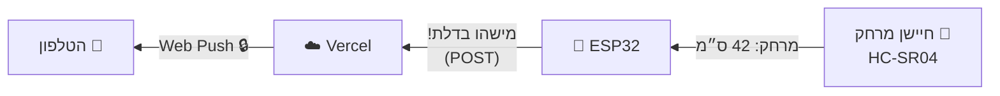
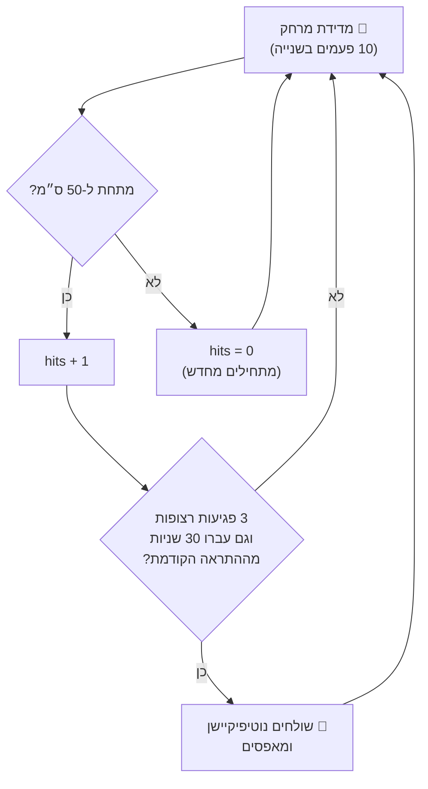

# ⁧🚪 פרויקט המשך: פעמון דלת חכם⁩

> ⁧מחברים את חיישן המרחק משיעור 2 למערכת הנוטיפיקיישנים מהשיעור האחרון — וכשמישהו מתקרב לדלת, הטלפון מצלצל. מכל מקום בעולם.⁩

## ⁧🎯 מה בונים⁩

⁧הכי חשוב: **הענן כבר בנוי.** השרת, האפליקציה, הנוטיפיקיישנים — הכול עובד מהשיעור הקודם. היום נוגעים רק ב-firmware. זה בדיוק הכוח של הפרדה טובה בין רכיבים 😉⁩

## ⁧🧠 שלושה מושגים חדשים⁩

⁧הקוד החדש מכניס שלושה רעיונות שכל מערכת אמיתית צריכה:⁩

| ⁧מושג⁩ | ⁧הבעיה שהוא פותר⁩ | ⁧אצלנו⁩ |
|---|---|---|
| **⁧סף (Threshold)⁩** | ⁧"קרוב" זה לא ערך — זו החלטה. ממתי מתריעים?⁩ | ⁧פחות מ-50 ס"מ = מישהו בדלת⁩ |
| **⁧דיבאונס (Debounce)⁩** | ⁧חיישנים משקרים לפעמים — מדידה בודדת יכולה להיות רעש⁩ | ⁧דורשים 3 מדידות רצופות מתחת לסף⁩ |
| **⁧קולדאון (Cooldown)⁩** | ⁧מישהו שעומד בדלת = עשר מדידות בשנייה = הצפת נוטיפיקיישנים 😱⁩ | ⁧אחרי התראה — 30 שניות שקט⁩ |

⁧📌 שלושת אלה מופיעים כקבועים בראש הקוד — שחקו איתם! מה קורה עם סף של 200 ס"מ? עם קולדאון של 3 שניות?⁩

## ⁧🔌 חיווט — שימו לב, זה שונה משיעור 2!⁩

⁧בשיעור 2 חיברנו את החיישן ל-Arduino Uno. ה-ESP32 הוא לוח אחר, עם שני הבדלים קריטיים:⁩

| ⁧רגל בחיישן⁩ | ⁧לאן מחברים ב-ESP32⁩ |
|---|---|
| VCC | ⁧‏5V (הפין שכתוב עליו VIN או 5V)⁩ |
| GND | GND |
| TRIG | GPIO 5 |
| ECHO | **⁧GPIO 18 — אבל דרך מחלק מתח! ⚠️ קראו למטה⁩** |

> ### ⁧⚠️ אזהרת חומרה — לקרוא לפני שמחברים!⁩
>
> ⁧ה-HC-SR04 עובד על 5V, ולכן פין ה-ECHO שלו מחזיר אות של **5 וולט**. הפינים של ה-ESP32 בנויים ל-**3.3 וולט בלבד** — חיבור ישיר עלול לשרוף את הפין לאורך זמן.⁩
>
> ⁧הפתרון: **מחלק מתח** (Voltage Divider) — שני נגדים פשוטים שמורידים את האות לגובה בטוח:⁩
>
> ⁧ECHO ← נגד ‏1kΩ ← (הנקודה הזו ל-GPIO 18) ← נגד ‏2kΩ ← GND⁩
>
> ⁧ככה ה-GPIO רואה בערך 3.3V במקום 5V. שני נגדים, שתי דקות עבודה, פין שלם.⁩

## ⁧👣 שלבי העבודה⁩

1. ⁧**חיווט** לפי הטבלה למעלה (עם מחלק המתח!)⁩
2. ⁧**מעתיקים את הקוד** מגיטהאב: <code>⁨firmware/esp32-doorbell/esp32-doorbell.ino⁩</code> — בדיוק כמו בשיעור הקודם (כפתור 📋 בדף הקובץ)⁩
3. ⁧**מדביקים** ב-Arduino IDE ומעדכנים את אותן 4 שורות קונפיג (WiFi, כתובת, סיסמה) — אותם ערכים מהפרויקט הקודם!⁩
4. ⁧**Upload** ופותחים Serial Monitor ‏(115200)⁩
5. ⁧עוברים מול החיישן 🚶 — והטלפון מצלצל: "מישהו בדלת! מרחק: 42 ס"מ" 🔔⁩

⁧✔️ **מה אמור לקרות ב-Serial:** שורת <code>⁨distance: ...⁩</code> עשר פעמים בשנייה. כשעוברים מול החיישן — המונה <code>⁨hits⁩</code> מטפס 1, 2, 3 — ונשלחת התראה.⁩

## ⁧🔍 מה קורה בקוד — הזרימה⁩

⁧📌 שימו לב מה *לא* השתנה: הפונקציה <code>⁨sendNotification()⁩</code> זהה לחלוטין לפרויקט הקודם. שכבת ה"דיבור עם הענן" לא יודעת ולא צריכה לדעת מי קורא לה — כפתור, חיישן מרחק, או מה שתבנו הלאה. זה עקרון ה-API בזעיר אנפין.⁩

## ⁧🤔 שאלות להעמקה (לחשוב, ואז לשאול את קלוד)⁩

1. ⁧למה המדידה מחזירה <code>⁨-1⁩</code> לפעמים, ולמה הקוד מתעלם ממנה בכוונה?⁩
2. ⁧מה יקרה אם נוריד את <code>⁨CONSECUTIVE_HITS⁩</code> ל-1? נסו מול חלון פתוח 😉⁩
3. ⁧איך הייתם מוסיפים "מצב לילה" — התראות רק בין 22:00 ל-07:00? (רמז: ל-ESP32 אין שעון — מאיפה משיגים שעה?)⁩
4. ⁧אתגר: בקשו מקלוד להוסיף לאפליקציה כפתור "השתק ל-שעה" שמדבר עם ה-ESP32. מה צריך להשתנות בארכיטקטורה? (זה כבר פרויקט התקשורת הדו-כיוונית!)⁩

